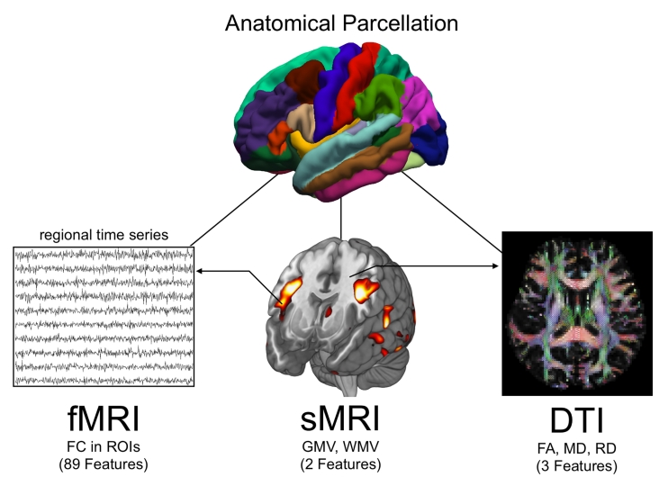

# 人脑连接组分析-课题管理

## 背景
* [磁共振影像](#磁共振影像)
* [人脑连接组](#人脑连接组)
* [影像公开数据](#影像公开数据)
* [课题管理](#课题管理)

## 磁共振影像
### 极简版介绍
磁共振成像系统基本原理是利用人体内水分子中的原子核（主要是氢质子）在强磁场中的磁共振信号经重建进行组织或器官的成像。

**优点：**
1. MRI对人体没有电离辐射损伤；
2. MRI能获得原生三维断面成像而无需重建就可获得多方位的图像；
3. 软组织结构显示清晰，对中枢神经系统的检查优于CT；
4. 多序列成像（所谓多模态），为明确病变性质提供更丰富的影像信息。

以下成像理论科普，了解即可：
[参考资料-1](https://zhuanlan.zhihu.com/p/82072660)

### MRI模态的基本概念
-   结构磁共振影像（sMRI, structural MRI），提供大脑的组织结构信息，如灰质、白质、脑脊液。脑解剖分区及形态测量分析中，通常需要利用sMRI模态对应扫描序列是T1-weighted三维图像；
-   弥散磁共振成像（dMRI, diffusion MRI），通过计量人体组织内水分子随机运动的特性来追踪大脑白质纤维并反映其解剖连接性。dMRI最常见的扫描protocol是DTI，其它protocol包括DKI、NODDI等；
-   功能磁共振影像（fMRI, functional MRI），基于血氧水平依赖性信号，反映大脑执行某种任务（task-fMRI）或者静息态(rs-fMRI)时，对应脑区的神经元功能活动。其理论基础是血氧水平依赖（BOLD），因此fMRI脑功能信号常称作BOLD信号。

## 人脑连接组
### 人脑连接与脑网络
人脑约1000亿个神经元和千亿级神经突触连接可以用多种数学模型以复杂矩阵的方式表示。其中一种模型是把空间上分离的且周期性放电的神经元比喻成众多的振荡器。在微观-介观-宏观层面上，人脑连接组用节点和连接边组成了网络结构，通过以环路触发的瞬时激活/抑制(即协调同步)的方式实现动态地聚集协作。需要强调的是：基于MRI的人脑连接组局限在宏观层面（空间尺度）。

大脑功能的实现依赖于不同功能的大脑系统之间的有效沟通。因此连接组领域的首要目标是了解连接组的网络组织与大脑神经处理和大脑功能的能力之间的关系。同时，它也拥有一个强大的工具集来检测连接组如何改变可能会导致疾病中的大脑功能障碍。

在分析人脑连接组的构成时，脑网络被描述成一系列的节点（脑区或神经元集群）和节点之间的连边（结构或功能连接）。人脑连接组有两个基本属性：不同功能的脑区（包括认知、感觉运动整合、辨识和行为）彼此分隔（称为segregation）；不同功能区通过神经元和区域间连接将功能整合（称为integration）。

### 脑网络的模块化和整合
**segregation和integration**是实现脑网络基本原则的基本途径。脑网络的基本原则体现在两个方面：
- 将脑网络形成所需的物理和代谢成本最小化的趋势；
- 全脑不同大脑区域之间有效的神经通信（不仅仅是相连，还要高效）。

在实现这两个原则的过程中，模块化对于降低大脑在具体区域的代谢成本而言有决定性的作用，而整合则实现了不同区域在局部模块化实现后的远距离信息的高效传输。

**segregation和integration**是大脑在发展和进化的过程中共同出现的，但它们又有些相反。节约布线成本的驱动(例如，促进模块化组织)通常与促进有效的系统集成的同步驱动不相容。促进密集连接的枢纽和全脑连接的同时，就要求在设计全局最优的网络拓扑时，这些相互竞争的目标通过折中或权衡得到解决，从而在低成本的连接组架构中将它们的联合表达最大化。

### 连接组与脑疾病
一些大脑疾病似乎是由局限于特定局部网络的中断引起的。例如，以不同行为症状为特征的不同神经退行性综合征最初针对特定的功能子系统。如阿尔茨海默病中皮质萎缩的模式反映了默认网络的空间分布，而额颞叶痴呆的萎缩模式反映了突显网络的布局，以及肌萎缩侧索硬化（ALS）最初主要影响运动网络。

同时，神经“integration”为疾病对全局网络的影响提供了更广泛的路径。首先，就像在互联网、通讯和交通网络中一样，大脑中枢的中心位置使它们容易受到攻击，成为全局网络破坏的常见源头。它们的高中心性进一步导致了神经元结构、生理和代谢的差异，使它们成为疾病过程中常见的参与者。第二，保持高水平的全脑沟通和一体化的总体动力，使人类大脑容易出现局部变化迅速扩散的风险，并在整个网络中引发一系列关键的故障（级联网络故障）。**级联网络故障理论**是指，连接组的初始本地变异是跨网络级联的。其中一个网络节点的故障触发拓扑相邻节点的补偿效应(例如，活动增加)，目的是接管故障节点的角色，并保持最佳的大脑功能状态。这些节点负担的增加将反过来导致它们失败的概率增加，从而引发整个网络中节点的级联故障。关键节点的全局连接性使它们更有可能参与这种补偿过程。在参与级联网络障碍的过程中，疾病的扩散就会导致更多网络关键节点的被攻击。

### 什么是连接组学
构成人类大脑的复杂脑网络连接被称为**脑连接组（human connectome）**。连接组是大脑皮层和皮层下结构（统称为灰质）之间的白质，这些连接就像电线一样，在大脑的功能区之间传递信息。所有独立连接都携带着来自不同且高度复杂的处理单元的数据。

“连接组学”一词源于 “基因组学”，即利用大数据来研究生物体的遗传学。英文的 Connectomics（连接组学）借用了“-omics（组学）”的后缀，因为它采用了类似的方法：大数据分析海量数据集，用于构建人类连接组数字化图谱。

### 人脑连接组计划
在 2009 年，人脑连接组计划 (HCP) 开展了为期五年的工作，以数字化方式绘制人类大脑的结构和功能神经连接。这个初始耗资 3850 万美元的项目始于美国国立卫生研究院的蓝图大挑战基金，并联合了世界顶级神经科学机构。该公开数据库目前被试数约1200人，包括结构MRI、静息态MRI、任务态fMRI、MEG等数据模态，其他数据还包括人口统计学数据、神经心理学数据、基因数据。

## 影像公开数据
### HCP数据
人口学和行为学基础信息：
- /data/unrestricted_HCP_behavior_data.csv: 被试的人口学和行为学基础信息，来自HCP官网
- /data/restricted_HCP_behavior_data.mat: 受限的行为学特征（作为基础信息的补充，来自文章[PMID: 33615091](https://pubmed.ncbi.nlm.nih.gov/33615091/)）
- /data/HCP_S1200_DataDictionary.xlsx: 被试的人口学和行为学变量解释，来自HCP官网
- 其中认知功能评分包含以下几类：
-- Episodic Memory
-- Executive Function/Cognitive Flexibility
-- Fluid Intelligence
-- Language
-- Processing Speed
-- Self-regulation/Impulsivity
-- Spatial Orientation
-- Sustained Attention
-- Working Memory
-- Composite总分

部分公开的脑连接组资源：
1. 来自[Fallon2020文章](https://pubmed.ncbi.nlm.nih.gov/33615091/)共享的脑连接组数据，[点此下载](https://zenodo.org/record/4643074)。这组HCP数据**只公开了其中100个人**，其中包含[FreeSurfer Desikan-Killiany皮层图谱](https://surfer.nmr.mgh.harvard.edu/ftp/articles/desikan06-parcellation.pdf)，以及[HCPMMP1 Glasser360皮层图谱](https://figshare.com/articles/dataset/HCP-MMP1_0_projected_on_fsaverage/3498446/2)分区下对应的脑结构网络和静息态脑功能网络。这部分数据由于样本量不够大，一般用于方法验证。以下是[Fallon2020脑连接组](https://zenodo.org/record/4643074)的部分数据说明：
- connectome/aparc_acpc_connectome_data.mat: Desikan-Killiany皮层图谱对应的脑网络，其中`SIFT2_den`对应脑结构网络，`standard_length`对应脑区节点之间的距离。
- connectome/HCPMMP1_acpc_connectome_data.mat: HCPMMP皮层图谱对应的脑网络，其中`SIFT2_den`对应脑结构网络，`standard_length`对应脑区节点之间的距离。
- rsfMRI/cfg.mat：其中`roiTS`代表BOLD时序信号，可用于构建脑功能网络 

2. 来自[Cheng2019文章](https://doi.org/10.7554/eLife.40765)共享的脑连接组数据，[点此下载](https://doi.org/10.5061/dryad.736t01r)。这组HCP数据公开了其中**831个人的脑功能网络**，图谱采用[AAL120全脑图谱](https://www.sciencedirect.com/science/article/pii/S1053811919307803)。

## 课题管理
1. [人脑认知加工功能的影像梯度模式识别](resources/brain_gradients.md)
2. [人脑影像功能动态分析计算方法](resources/dFC.md)
3. [神经调控下的脑影像状态切换机制](resources/dbs_brainstates.md)
4. [神经系统疾病的脑活动时空动态异常表征方法研究](resources/complex.md)
5. [神经调控下的脑影像标志物挖掘](resources/fusa_brainstates.md)
6. 个体化脑功能共激活状态分析研究及应用

