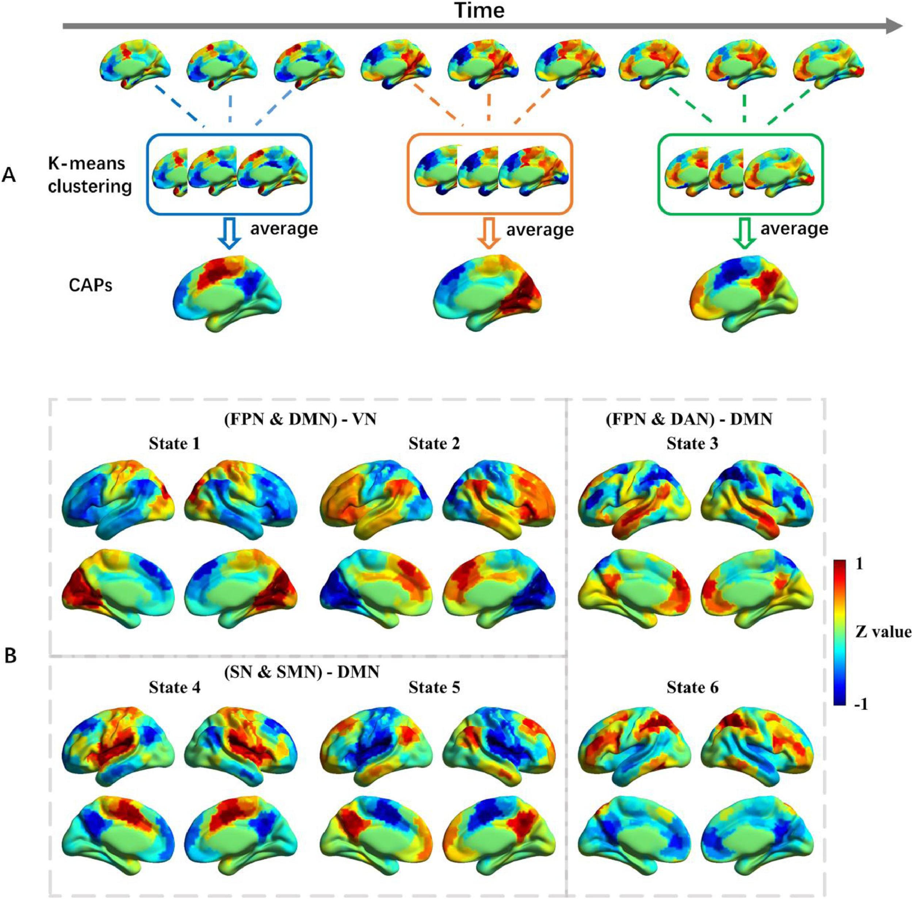

## 个体化脑功能共激活状态分析研究及应用
### 背景
人类的大脑好似一台“永动机”，时刻处于不断波动的状态。当我们在看书、思考、放松、或是聊天娱乐时，大脑都处于不同的活动状态。甚至在做一件事情时，大脑也在不同的活动状态间变换更迭。同样，健康的大脑和罹患神经系统或精神疾病的大脑也会有截然不同的活动状态。动态功能连接(dynamic FC, dFC)试图以有意义的方式解析静息态(resting-state, RS)的dFC已经在一系列方法学变体中展开。除了作为各种脑部疾病生物标志物的潜力，dFC对神经疾病的直接治疗应用也可以预见。在此背景下，通过dFC方法追踪大脑功能动力学作为一种有吸引力的工具脱颖而出。此外，调节活动或连接的动态特征也可能被证明是治疗大脑动力学受到特别阻碍的疾病的有效策略。

到目前为止描述的基于滑动窗口的方法从BOLD fMRI信号中提取测量值，其隐含假设是自发大脑活动具有缓慢但不断变化的时间动力学特征。然而一种替代观点表明关于RS期间FC的相关信息实际上可以浓缩为事件或短时间段，其代表性方法叫做co-activation patterns （CAP）。该方法实际上可以从单个帧的观察中检索到有意义的信息，从而在连接性分析趋势中产生了一种强大的替代方法：从时间窗口的角度——产生二阶统计的连接性图——到单帧的分析，例如在点过程分析(point process analysis, PPA)中，产生时序的共激活图（一阶统计量）。自发活动在短时间内被浓缩的一个潜在解释可能来自神经元雪崩活动的存在，该活动仅引起短暂的神经元事件。

### 目的
本课题以基于fMRI影像的人脑BOLD时序信号为研究对象，验证CAP方法在人脑fMRI影像大数据中的稳定性和有效性，在此基础上针对帕金森病的影像辅助诊断开展应用分析，同时开发完成基于python的人脑CAP计算工具包。

### 准备工作
1. 理解MRI影像及脑连接组基础概念，[部分参考](https://github.com/chenfei-ye/students_proj)。
2. 熟练掌握CAP计算方法[^caps]的计算流程。
3. 基于[预处理后的HCP脑功能网络数据](https://github.com/chenfei-ye/students_proj#hcp%E6%95%B0%E6%8D%AE)估计个体被试的单帧共激活状态。

### 研究内容
1. 基于CAP识别健康成年人脑功能活动对应的脑状态[^34048900][^35503014]，探索各状态对应的脑区激活分布；
2. 在大样本人群中验证CAP方法在人脑fMRI影像大数据中的稳定性和有效性；
3. 分别针对深脑电刺激（DBS）术前术后研究PD患者的CAP脑状态切换规律（重点参考文献[^36623929][^32250724]），对脑状态及状态之间的切换关系进行可视化。

### 技术指标
1. 建立一个基于CAP模型的脑状态估计流程(python版本)，提出不少于3种脑状态的描述性指标[^metrics]。
2. 脑状态的可重复性(test-retest reliability)(参考文献[^36652524])不低于95%。

### 关键点
1. 深入理解DBS的作用机制，参考文献[^36623929][^32250724]
2. 数据优先使用[预处理后的HCP脑功能网络数据](https://github.com/chenfei-ye/students_proj#hcp%E6%95%B0%E6%8D%AE)进行脑状态识别的尝试。
3. 可视化参考[nilearn](https://nilearn.github.io/dev/index.html)。

### 思考
1. CAP相比滑窗法、HMM识别静息态脑状态有何优势和劣势？

[^34048900]: Yang H, Zhang H, Di X, Wang S, Meng C, Tian L, Biswal B. Reproducible coactivation patterns of functional brain networks reveal the aberrant dynamic state transition in schizophrenia. Neuroimage. 2021 Aug 15;237:118193. doi: 10.1016/j.neuroimage.2021.118193. Epub 2021 May 25. PMID: 34048900.
[^caps]: https://github.com/davidyoung1994/CoactivationPattern
[^36623929]: Chu C, Liu S, He N, Zeng Z, Wang J, Zhang Z, Zeljic K, van der Stelt O, Sun B, Yan F, Liu C, Li D, Zhang C. Subthalamic stimulation modulates motor network in Parkinson’s disease: recover, relieve and remodel. Brain. 2023 Jul 3;146(7):2780-2791. doi: 10.1093/brain/awad004. PMID: 36623929.
[^32250724]: McCormick DA, Nestvogel DB, He BJ. Neuromodulation of Brain State and Behavior. Annu Rev Neurosci. 2020 Jul 8;43:391-415. doi: 10.1146/annurev-neuro-100219-105424. Epub 2020 Apr 6. PMID: 32250724.
[^35503014]: Liu T, Wang L, Suo D, Zhang J, Wang K, Wang J, Chen D, Yan T. Resting-State Functional MRI of Healthy Adults: Temporal Dynamic Brain Coactivation Patterns. Radiology. 2022 Sep;304(3):624-632. doi: 10.1148/radiol.211762. Epub 2022 May 3. PMID: 35503014.
[^36652524]: Peng X, Liu Q, Hubbard CS, Wang D, Zhu W, Fox MD, Liu H. Robust dynamic brain coactivation states estimated in individuals. Sci Adv. 2023 Jan 18;9(3):eabq8566. doi: 10.1126/sciadv.abq8566. Epub 2023 Jan 18. PMID: 36652524; PMCID: PMC9848428.
[^metrics]: a) frequency of occurrence (the number of times each state occurs per second), b) state duration (the average time an individual resides in each state during the scanning session) and c) fractional coverage (the proportion of time that an individual resides in the state during scanning)

