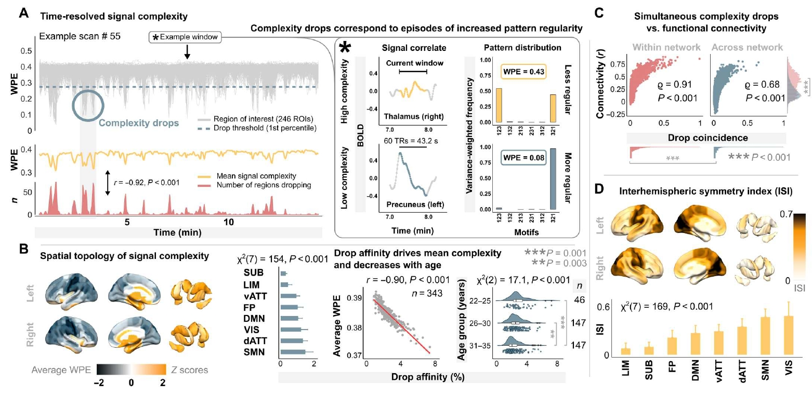

## 神经系统疾病的脑活动时空动态异常表征方法研究

### 背景
人类的大脑运作在大规模功能网络中，这些网络总称为功能性人脑连接组，空间分布不同的脑区域之间具有时间相关性的活动。神经信号的这种协方差通常称为功能连接（FC），从功能性磁共振成像（fMRI）中估计FC揭示了大脑的功能体系结构中的重要特征。首先，FC在大脑中不是均匀分布的，而是被组织成为休息状态下的网络（RSNs）功能子系统。其次，FC不是静态的，而是表现为动态波动，形成明显的时间网络状态。第三，在网络结构中，没有随机性，而是遵循一种有效拓扑结构来反映网络内的通讯构型。最后，大脑网络在功能上不是统一的，而是沿着从低阶单模到高阶跨模处理系统的一种主层次组织。

目前，理解人类连接组的结构、时间动态和层次仍是一个根本性挑战，需要一个解释性框架将全局网络结构与个体脑区域的局部活动相联系。FC 以及基于FC计算的网络属性都是根据区域信号之间的协方差关系定义的，但这种网络建构具有方向性（区域活动定义区域之间协方差，但不可反向计算），网络的全局特性最终必须根植于单个脑区域的神经动力学。因此，神经活动波动的可变性导致了定义网络的协方差结构，但全局网络结构如何与局部神经活动的可变性联系仍然不完全清楚。

### 目的
本课题以脑活动时空动态表征模式为研究对象，研究如何利用信息理论复杂性分析来刻画人脑静息状态下功能活动的动态变异性，解析帕金森病患者的脑功能信号的可变性特征，从全脑功能活动时空复杂性分析的角度揭示帕金森病的脑机制。

### 准备工作
1. 理解MRI影像及脑连接组基础概念，[部分参考](https://github.com/chenfei-ye/students_proj)。
2. 精读核心参考文献[^36724223]，并深入理解如何利用信息理论复杂性分析来描述人脑功能活动的动态变异性。

### 研究内容
1. 利用信息理论实现人脑静息态功能活动的局部复杂性（WPE）计算（方法主要参考文献[^36724223]）；在HCP功能影像数据[^fallon]上复现参考文献[^36724223]中Fig1的主要结果；
2. 基于脑活动复杂状态聚类，研究表征脑活动复杂性变化的静息态脑状态方法（主要参考文献[^36724223]中Fig3的相关方法）。
3. 针对帕金森病的rs-fMRI影像数据，解析脑功能活动复杂性的疾病特异性时空模式，并探索该模式与帕金森病患者行为学表型（运动障碍与神经心理学量表）的关联。

### 技术指标
1. 提出一种表征人脑静息态功能活动的局部复杂性的方法；在至少两种脑图谱中评估不同脑区（皮层及皮层下区域）的神经活动复杂性特点，并验证该方法的跨图谱稳定性（DK图谱和HCPMMP图谱）。
2. 建立一个基于脑功能活动复杂性特征的帕金森病机器学习分类模型，分类准确率不低于80%。
3. 发现与脑功能活动复杂性特征具有统计显著性相关且相关系数>0.3的帕金森病认知行为功能表型[^量表]不少于2种。

### 关键点
1. 拟解决的科学问题和方法意义，须参考文献[^36724223]的introduction和discussion部分，**要具体体现在研究背景中**。
2. dFC可视化用[nilearn](https://nilearn.github.io/dev/index.html)。
3. 数据优先使用[预处理后的HCP脑功能网络数据](https://github.com/chenfei-ye/students_proj#hcp%E6%95%B0%E6%8D%AE)。
4. 动态FC需要根据BOLD时序信号进行计算。
5. 帕金森病机器学习分类建模参考文献[^34130192]。
6. 量表相关分析可参考文献[^35184336]。
7. 思考以下问题。

### 思考
1. 局部脑区WPE和脑功能连接有和关系？
2. 状态分散指数（SDI）的本质是什么？

[^36724223]: **Krohn S, von Schwanenflug N, Waschke L, Romanello A, Gell M, Garrett DD, Finke C. A spatiotemporal complexity architecture of human brain activity. Sci Adv. 2023 Feb 3;9(5):eabq3851. doi: 10.1126/sciadv.abq3851. Epub 2023 Feb 1. PMID: 36724223; PMCID: PMC9891702.**
[^fallon]: Fallon J, Ward PGD, Parkes L, Oldham S, Arnatkevičiūtė A, Fornito A, Fulcher BD. Timescales of spontaneous fMRI fluctuations relate to structural connectivity in the brain. Netw Neurosci. 2020 Sep 1;4(3):788-806. doi: 10.1162/netn_a_00151. PMID: 33615091; PMCID: PMC7888482.
[^34130192]: Yang Y, Ye C, Sun J, Liang L, Lv H, Gao L, Fang J, Ma T, Wu T. Alteration of brain structural connectivity in progression of Parkinson's disease: A connectome-wide network analysis. Neuroimage Clin. 2021;31:102715. doi: 10.1016/j.nicl.2021.102715. Epub 2021 Jun 6. PMID: 34130192; PMCID: PMC8209844.
[^量表]: 如UPDRS、MMSE等。
[^35184336]: Ye C, Huang J, Liang L, Yan Z, Qi Z, Kang X, Liu Z, Dong H, Lv H, Ma T, Lu J. Coupling of brain activity and structural network in multiple sclerosis: A graph frequency analysis study. J Neurosci Res. 2022 May;100(5):1226-1238. doi: 10.1002/jnr.25028. Epub 2022 Feb 20. PMID: 35184336.

