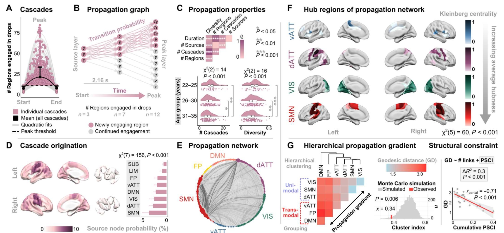

## 针对帕金森病的脑功能时域复杂度表示计算方法研究

### 背景
人类的大脑运作在大规模功能网络中，这些网络总称为功能性人脑连接组，时空分布不同的脑区域之间具有时间相关性的活动。神经信号的这种协方差通常称为功能连接(FunctionalConnectivity ，FC)。脑功能分区的功能活动、功能分区之间功能活动的整合，都离不开功能连接的作用。如果脑区之间的功能连接发生异质化，很有可能导致神经系统疾病，造成脑的功能失常，使病人的生活难以正常进行。理解不同神经系统疾病的病理，都离不开对脑功能分区功能连接的研究。

血氧水平依赖(Blood Oxygen Level Dependent，BOLD)是功能核磁共振(functional Magnetic Resonance Imaging，fMRI)探测脑网络神经元功能的基础，血氧水平的变化是由于局部脑血流量发生变化，而局部脑血流量的变化又与局部脑功能活跃程度密切相关。因此，分析血水平依赖信号变化可以帮助本文理解脑功能活动。静默状态下，人的大脑往往处于高复杂度状态，要进行不同的神经功能活动，必须要降低功能区域的复杂度水平，由于BOLD信号与神经信号存在等幅变化关系，它的复杂度能够表征脑功能区域的复杂度水平变化，体现脑区的功能活动水平，反映脑区域之间功能连接的特征。

帕金森病(Parkinson'sDisease，PD)是一种常见于中老年人的慢性进行性神经系统病变，其病理往往通过人脑神经功能网络传播，使病人的症状越来越严重。帕金森病往往导致病人脑网络的功能活动区域发生异质化，使不同脑区域的功能连接作用受损，导致病人出现不同程度的残疾。分析信号的复杂度动态特征，表征脑区的功能活动特征，构建脑网络功能活动架构，有利于理解脑区域功能连接特征，理解帕金森病所引起的功能活动异质化。

### 目的
本课题以脑活动时空动态表征模式为研究对象，研究如何利用信息理论复杂性分析来刻画人脑静息状态下功能活动的动态变异性，解析帕金森病患者的脑功能信号的可变性特征，从全脑功能活动时空复杂性分析的角度揭示帕金森病的脑机制。

### 准备工作
1. 理解MRI影像及脑连接组基础概念，[部分参考](https://github.com/chenfei-ye/students_proj)。
2. 精读核心参考文献[^36724223]，并深入理解如何利用信息理论复杂性分析来描述人脑功能活动的动态变异性。
3. 和杜钰学长具体对接，课题定位在核心参考文献[^36724223]中未复现的部分（重点是Fig.2）。

### 研究内容
1. 基于信息理论实现人脑静息态功能活动的局部复杂性（WPE）计算（方法主要参考文献[^36724223]）；在HCP功能影像数据[^fallon]上复现参考文献[^36724223]中Fig.2的主要结果；
2. 针对帕金森病的rs-fMRI影像数据，刻画脑功能活动复杂度在PD患者脑中的特异性传播模式。

### 技术指标
1. 提出一种表征人脑静息态功能活动的局部复杂性的方法；在至少两种脑图谱中评估不同脑区（皮层及皮层下区域）的神经活动复杂性特点，并验证该方法的跨图谱稳定性（DK图谱和HCPMMP图谱）。
2. 建立一个基于脑功能活动复杂性特征的帕金森病机器学习分类模型，分类准确率不低于80%。
3. 发现与脑功能活动复杂性特征具有统计显著性相关且相关系数>0.3的帕金森病认知行为功能表型[^量表]不少于2种。

### 关键点
1. 拟解决的科学问题和方法意义，须参考文献[^36724223]的introduction和discussion部分，**要具体体现在研究背景中**。
2. dFC可视化用[nilearn](https://nilearn.github.io/dev/index.html)。
3. 动态FC需要根据BOLD时序信号进行计算。
4. 思考以下问题。

### 思考
1. 局部脑区WPE和脑功能连接有和关系？
2. 状态分散指数（SDI）的本质是什么？

[^36724223]: **Krohn S, von Schwanenflug N, Waschke L, Romanello A, Gell M, Garrett DD, Finke C. A spatiotemporal complexity architecture of human brain activity. Sci Adv. 2023 Feb 3;9(5):eabq3851. doi: 10.1126/sciadv.abq3851. Epub 2023 Feb 1. PMID: 36724223; PMCID: PMC9891702.**
[^fallon]: Fallon J, Ward PGD, Parkes L, Oldham S, Arnatkevičiūtė A, Fornito A, Fulcher BD. Timescales of spontaneous fMRI fluctuations relate to structural connectivity in the brain. Netw Neurosci. 2020 Sep 1;4(3):788-806. doi: 10.1162/netn_a_00151. PMID: 33615091; PMCID: PMC7888482.
