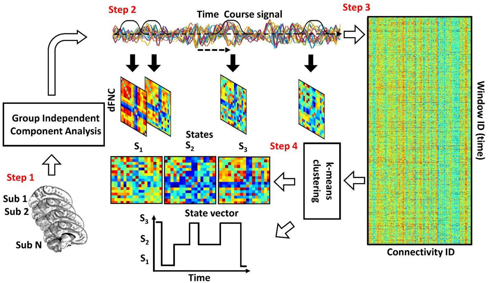

## 人脑影像功能动态分析计算方法

### 背景
近二十年来，静息态(resting-state, RS)功能磁共振成像(fMRI)为自发大脑活动的时空组织带来了新的曙光。RS波动的丰富和复杂结构可以用不同的脑网络(resting-state networks, RSNs)来描述，这是由一组分布脑区的相干波动引起的。通常，在6分钟或更长时间的整个RS扫描中计算空间位置之间的统计相互依赖关系；Pearson相关系数是最常用的功能连接(functional connectivity, FC)指标。

最近，FC被证明随着时间的推移而波动，这意味着在整个RS扫描上假设平稳性的测量可能过于简单，无法捕获RS活动的全部程度。自这些初步发现以来，随后的研究迅速蓬勃发展，以研究所谓的动态功能连接(dynamic FC, dFC)，试图以有意义的方式解析RS的dFC已经在一系列方法学变体中展开。除了作为各种脑部疾病生物标志物的潜力，dFC对神经疾病的直接治疗应用也可以预见。在此背景下，通过dFC方法追踪大脑功能动力学作为一种有吸引力的工具脱颖而出。此外，调节活动或连接的动态特征也可能被证明是治疗大脑动力学受到特别阻碍的疾病的有效策略。

### 目的
本课题以基于静息态fMRI影像构建的人脑动态功能连接dFC为研究对象，提出一种基于dFC估计人脑功能状态（brain states）的高效计算方法，旨在提升脑功能状态估计的计算效率，在人脑fMRI影像大数据中验证方法的有效性，同时开发完成基于python的人脑功能状态计算工具包。

### 准备工作
1. 理解MRI影像及脑连接组基础概念，[部分参考](https://github.com/chenfei-ye/students_proj)。
2. 熟练掌握dFC脑状态分析的计算流程[^参考工具1]，并深入理解脑连接组梯度的计算本质。
3. 基于[预处理后的HCP脑功能网络数据](https://github.com/chenfei-ye/students_proj#hcp%E6%95%B0%E6%8D%AE)计算dFC脑状态，以及可视化。
4. 认真阅读文末参考文献（粗体为重点）[^35958983][^37021138][^23707587][^28698644]

### 研究内容
1. 针对滑窗法dFC，提出一种高效的脑状态估计算法（方法主要参考文献[^35958983]）；在HCP功能影像数据[^fallon]上验证算法的有效性；
2. 对比DK图谱和HCPMMP图谱不同脑网络构造条件下的算法性能，验证算法的泛化性；
3. 将提出的脑状态估计算法，应用于LEiDA分析方法[^28698644]，验证算法的泛化性；
4. 开发完成基于`python`的人脑功能状态计算工具包，并开源代码。

### 技术指标
1. 提出一种高效的脑状态估计算法；与传统方法相比，在脑状态相似性不低于95%的条件下，计算效率提高5倍以上[^5]。
2. 研发的人脑功能状态计算工具包，支持不少于2种动态功能分析方案[^分析方案]。

### 关键点
1. 具体的卡脖子问题主要参考文献[^35958983]的introduction部分。
2. 数据优先使用[预处理后的HCP脑功能网络数据](https://github.com/chenfei-ye/students_proj#hcp%E6%95%B0%E6%8D%AE)。
3. 动态FC需要根据BOLD时序信号进行计算。
4. 思考以下问题，试设计实验解答，并将实验对比中用到的方法集成在计算工具包中。

### 思考
1. 基于脑区的dFC和基于静息态脑网络的dFNC，对于脑状态估计有何差异？
2. 滑窗dFC和LEiDA的本质差异是什么？各适用于哪些分析场景？
3. 除了K-MEANS，还有哪些聚类算法可以提高脑状态估计的计算效率？
4. 除了elbow criteria，还有哪些方法适合评估最优聚类数量？

[^参考工具1]: 代码参考：https://github.com/guorongwu/DynamicBC
[^35958983]: **Sendi MSE, Salat DH, Miller RL, Calhoun VD. Two-step clustering-based pipeline for big dynamic functional network connectivity data. Front Neurosci. 2022 Jul 25;16:895637. doi: 10.3389/fnins.2022.895637. PMID: 35958983; PMCID: PMC9358255.**
[^37021138]: Wu K, Jelfs B, Mahmoud SS, Neville K, Fang JQ. Tracking functional network connectivity dynamics in the elderly. Front Neurosci. 2023 Mar 20;17:1146264. doi: 10.3389/fnins.2023.1146264. PMID: 37021138; PMCID: PMC10069653.
[^23707587]: Hutchison RM, Womelsdorf T, Allen EA, Bandettini PA, Calhoun VD, Corbetta M, Della Penna S, Duyn JH, Glover GH, Gonzalez-Castillo J, Handwerker DA, Keilholz S, Kiviniemi V, Leopold DA, de Pasquale F, Sporns O, Walter M, Chang C. Dynamic functional connectivity: promise, issues, and interpretations. Neuroimage. 2013 Oct 15;80:360-78. doi: 10.1016/j.neuroimage.2013.05.079. Epub 2013 May 24. PMID: 23707587; PMCID: PMC3807588.
[^28698644]: **Cabral J, Vidaurre D, Marques P, Magalhães R, Silva Moreira P, Miguel Soares J, Deco G, Sousa N, Kringelbach ML. Cognitive performance in healthy older adults relates to spontaneous switching between states of functional connectivity during rest. Sci Rep. 2017 Jul 11;7(1):5135. doi: 10.1038/s41598-017-05425-7. PMID: 28698644; PMCID: PMC5506029.**
[^fallon]: Fallon J, Ward PGD, Parkes L, Oldham S, Arnatkevičiūtė A, Fornito A, Fulcher BD. Timescales of spontaneous fMRI fluctuations relate to structural connectivity in the brain. Netw Neurosci. 2020 Sep 1;4(3):788-806. doi: 10.1162/netn_a_00151. PMID: 33615091; PMCID: PMC7888482.
[^分析方案]: 即滑窗dFC与LEiDA。
