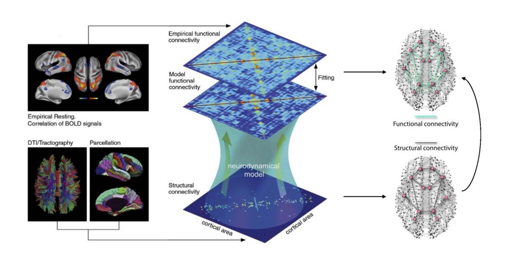

## 针对磁共振引导聚焦超声治疗震颤症状的神经动力学研究

### 背景
震颤是运动障碍的突出症状之一，在以震颤为主的帕金森病（TDPD）患者中通常表现为静止性震颤，而特发性震颤（ET）患者通常会出现运动性震颤或姿势性震颤。震颤的常规治疗以药物为主，但其疗效有限，且随着病程的进展，药物治疗可能导致不良反应。对于震颤导致生活质量严重下降的患者，需采取脑深部电刺激术、射频消融丘脑毁损术等手术治疗。然而，脑深部电刺激术的置入物或电刺激相关不良反应高，且维护成本高，而射频消融丘脑毁损术则存在毁损灶大小不可控、以及出血和视野缺失等风险。

磁共振引导聚焦超声（Magnetic Resonance-guided Focused Ultrasound，MRgFUS）又称磁波刀，是一种新兴的震颤治疗手段。该技术利用聚焦超声产生高温，导致靶区组织凝固坏死，并通过磁共振实时监控治疗范围和温度变化，确保精准定位及安全性。与其他手术方法相比，MRgFUS具有微创、精确定位和可保留靶区周围组织的优势。目前，丘脑腹侧中间核（VIM）被认为是治疗ET的标准靶点，也是TDPD的常见靶点。然而，尽管VIM消融对震颤的控制已被证实有效，但其潜在作用机制仍然未知，对影响其他运动症状（如僵直和运动迟缓）的影像仍未明确。同时，这些宏观疾病表征与介观的脑网络动力学之间的联系缺乏充分研究，MRgFUS如何改变疾病患者的大脑功能动态未被阐明。

磁共振成像技术（如fMRI、DTI等）可以从功能和白质纤维束结构等方面评估MRgFUS干预前后的脑部变化。然而，传统的计算连接组学研究主要集中于静态的脑结构和功能连接模式，难以捕捉脑网络的动态特性和时变性。随着神经计算建模方法的发展，脑网络模型（Brain Network Models，BNMs）被用来定量描述多种神经和精神疾病背后的异常网络动态，以深入了解运动症状的病理生理机制和神经调控的干预机制。通过个性化调整生物物理参数，BNMs能够模拟不同状态下的大脑活动，揭示脑网络的时空动力学变化，深入探索与特定神经疾病相关的大脑功能连接动态重组。

### 目的
本课题基于患有严重手部震颤的TDPD及ET患者组和健康对照组的脑影像数据，构建个体被试的脑网络神经动力学模型，以研究MRgFUS手术在精确消融VIM前后患者的大脑网络功能动态变化，特别是手部运动功能相关的皮质和小脑功能连接网络的变化。

### 准备工作
1. 理解MRI影像及脑连接组基础概念[^24726580]，[部分参考](https://github.com/chenfei-ye/students_proj)。
2. 了解目前主流的大脑结构/功能分割图谱。
3. 学习脑网络动力学模型，精读神经集群模型相关文献[^28596608][^25592995]。
4. 熟悉The Virtual Brain 脑网络建模框架[^25592995][^23781198][^35131433]，并基于TVB复现基础的大脑电生理活动。

### 研究内容
1. 【对应毕业论文第三章的研究主题】基于结构连接数据，构建被试的脑网络模型，模拟出个体被试的神经动力学活动并计算模拟水平的功能连接；
2. 【对应毕业论文第四章的研究主题】引入功能连接平均指标[^32513827]，调整模型的目标参数，拟合模拟的功能连接到临床观测数据，以得到患者术前、患者术后和健康对照组的最佳拟合参数；
3. 【对应毕业论文第四章的实验结果解析】对比患者术前、患者术后和健康对照组的脑模型生物物理参数差异[^28851996]，分析患者在病理条件下和在接受MRgFUS治疗后的脑网络功能连接动态变化。

### 技术指标
1. 构建个体被试的脑网络模型，并模拟得到患者组和健康组的神经动力学。
2. 选取至少三个功能连接评价指标，通过参数空间探索获取脑网络模型最佳拟合临床功能影像数据的目标参数值。

### 关键点
1. 基于TVB平台实现脑网络建模与神经动力学模拟，并拟合个体BNM到临床观测数据。
2. 广泛阅读论文，熟悉常用神经集群模型中重要参数的病理生理含义，以完成神经调控干预前后的脑网络动态分析。
2. 可视化参考[nilearn](https://nilearn.github.io/dev/index.html)和[enigma](https://enigma-toolbox.readthedocs.io/en/latest/pages/12.visualization/index.html)。

[^24726580]: Fornito A, Bullmore ET. Connectomics: a new paradigm for understanding brain disease. Eur Neuropsychopharmacol. 2015 May;25(5):733-48. doi: 10.1016/j.euroneuro.2014.02.011. Epub 2014 Mar 5. PMID: 24726580.
[^28596608]: Deco G, Kringelbach ML, Jirsa VK, Ritter P. The dynamics of resting fluctuations in the brain: metastability and its dynamical cortical core. Sci Rep. 2017 Jun 8;7(1):3095. doi: 10.1038/s41598-017-03073-5. PMID: 28596608; PMCID: PMC5465179.
[^25592995]: Sanz-Leon P, Knock SA, Spiegler A, Jirsa VK. Mathematical framework for large-scale brain network modeling in The Virtual Brain. Neuroimage. 2015 May 1;111:385-430. doi: 10.1016/j.neuroimage.2015.01.002. Epub 2015 Jan 13. PMID: 25592995.
[^23781198]: Sanz Leon P, Knock SA, Woodman MM, Domide L, Mersmann J, McIntosh AR, Jirsa V. The Virtual Brain: a simulator of primate brain network dynamics. Front Neuroinform. 2013 Jun 11;7:10. doi: 10.3389/fninf.2013.00010. PMID: 23781198; PMCID: PMC3678125.
[^35131433]: Schirner M, Domide L, Perdikis D, Triebkorn P, Stefanovski L, Pai R, Prodan P, Valean B, Palmer J, Langford C, Blickensdörfer A, van der Vlag M, Diaz-Pier S, Peyser A, Klijn W, Pleiter D, Nahm A, Schmid O, Woodman M, Zehl L, Fousek J, Petkoski S, Kusch L, Hashemi M, Marinazzo D, Mangin JF, Flöel A, Akintoye S, Stahl BC, Cepic M, Johnson E, Deco G, McIntosh AR, Hilgetag CC, Morgan M, Schuller B, Upton A, McMurtrie C, Dickscheid T, Bjaalie JG, Amunts K, Mersmann J, Jirsa V, Ritter P. Brain simulation as a cloud service: The Virtual Brain on EBRAINS. Neuroimage. 2022 May 1;251:118973. doi: 10.1016/j.neuroimage.2022.118973. Epub 2022 Feb 4. PMID: 35131433.
[^32513827]: Courtiol J, Guye M, Bartolomei F, Petkoski S, Jirsa VK. Dynamical Mechanisms of Interictal Resting-State Functional Connectivity in Epilepsy. J Neurosci. 2020 Jul 15;40(29):5572-5588. doi: 10.1523/JNEUROSCI.0905-19.2020. Epub 2020 Jun 8. PMID: 32513827; PMCID: PMC7363471.
[^28851996]: Saenger VM, Kahan J, Foltynie T, Friston K, Aziz TZ, Green AL, van Hartevelt TJ, Cabral J, Stevner ABA, Fernandes HM, Mancini L, Thornton J, Yousry T, Limousin P, Zrinzo L, Hariz M, Marques P, Sousa N, Kringelbach ML, Deco G. Uncovering the underlying mechanisms and whole-brain dynamics of deep brain stimulation for Parkinson's disease. Sci Rep. 2017 Aug 29;7(1):9882. doi: 10.1038/s41598-017-10003-y. PMID: 28851996; PMCID: PMC5574998.