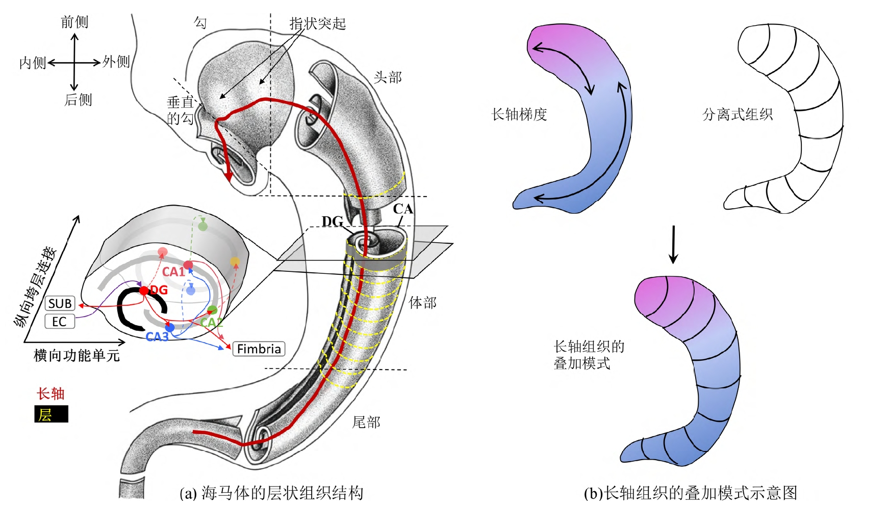

## 人脑海马体的形态表示和测量方法研究
### 背景
阿尔兹海默病(Alzheimer's Disease,AD)是一种逐步恶化的神经退行性疾病其显著特征之一是大脑结构的逐渐萎缩。目前，在磁共振影像中，体积变化是衡量大脑萎缩的主要方法，但在 AD早期，体积变化不够敏感且特异性不足。研究表明，海马体的各个亚区在 AD 早期受到不同程度的病理攻击，导致神经元衰亡因此对海马体局部萎缩模式的研究引起了广泛关注。然而，基于常规结构磁共振影像的方法尚未得出与组织学研究相一致的结论，这使得基于大规模影像数据的海马体形态萎缩特征难以成为可靠的疾病标志物。关键问题在于:海马体的形态及其在 AD 进展中的形变复杂，且存在较大的个体差异，难以在临床结构磁共振影像中准确度量海马体跨个体萎缩过程。

海马体的个体差异表现为前后轴弯曲度、前部和后部的比例、头部数量不等的指状凸起等。目前的研究很少关注这一问题，通常采用通用的图像配准和全局曲面重参数化方法，导致在个体差异较大的局部位置，这些方法不能形成具有解剖意义的对应关系。解决该问题的一个有效手段是根据海马体几何和解剖结构的内蕴不变性建立统一的坐标系。骨架表示具有天然的内蕴坐标系，即以其骨架面为起点，辐轴顶端可以索引到对象内部的任意位置。

### 目的
本课题以基于磁共振结构影像的人脑海马体的表面结构形态为研究对象，实现海马体几何和解剖结构的表面形态表示与测量方法，并评估药物治疗轻度认知障碍的海马体形态改变，以此探索药物干预机制。

### 准备工作
1. 和高娜博士具体对接，熟练掌握海马形态计算pipeline。
2. 熟悉docker相关指令。

### 研究内容
1. 【对应毕业论文第三章的研究主题】：基于轴参照骨架表示（ARMM）方法[^38994693]，开发完整的海马形态自动计算管线（pipeline），并依托Brainsite云平台实现海马形态计算微服务。
2. 【对应毕业论文第四章的研究主题】：针对宣武医院的药物干预研究，评估药物治疗轻度认知障碍的海马体形态改变，以此探索药物干预机制。

### 技术指标
1. 开发一个海马形态自动计算管线，并在不少于两个数据集上进行指标对比（ADNI数据和宣武医院数据）。
2. 识别轻度认知障碍患者海马形变的药物干预作用标志物，不少于两种类型（厚度、曲率）。

### 关键点
1. Brainsite云平台：http://brainsite.cn/
2. 自动计算管线（pipeline）需要封装成docker镜像，再上云。

[^38994693]: Gao N, Ye C, Chen H, Hao X, Ma T. MRI-based axis-referenced morphometric model corresponding to lamellar organization for assessing hippocampal atrophy in dementia. Hum Brain Mapp. 2024 Jul 15;45(10):e26715. doi: 10.1002/hbm.26715. PMID: 38994693; PMCID: PMC11240145.

