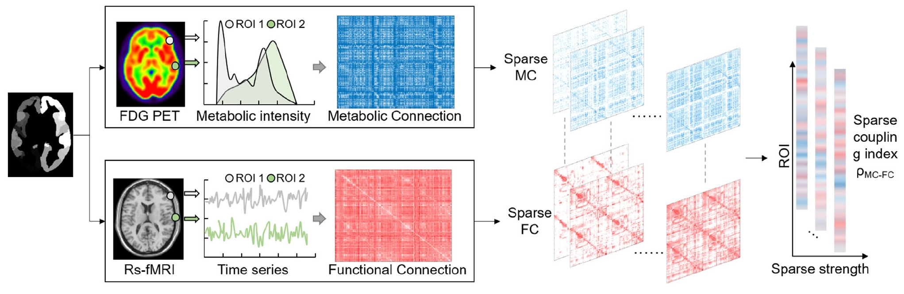

## 针对多发性硬化的神经炎性分子影像定量分析研究

### 背景
多发性硬化（multiple sclerosis，MS）以脑和脊髓内散在的多发斑片状脱髓鞘为特点。 常见症状包括视觉和动眼神经异常、感觉异常、无力、痉挛、泌尿功能障碍以及轻微的认知症状。MS是一种由自身免疫机制所导致的中枢神经系统炎性脱髓鞘疾病，具有终身性、进行性和致残性的临床特点。MS大多数患者在20-40岁首次发病，是导致青壮年残疾的最主要病因，对患者家庭造成沉重的经济和心理负担。多发性硬化的特点是可出现各种不同的中枢神经系统损害症状，并有反复的缓解和复发。然而，当前还不知道，神经炎性反应在MS病程起源与演变的过程中具有哪些作用？对MS患者的症状又有什么影响？

神经炎性反应是包括MS在内的许多神经退行性疾病的重要病理改变之一，小胶质细胞的激活为中枢神经系统炎性反应的主要特征。PET技术的出现和发展，为活体动态研究小胶质细胞在不同病理生理情况下的改变提供了一种有效的手段。

利用TSPO的放射性配体进行标记，通过正电子发射断层扫描显像(PET)在体显示MS患者激活的小胶质细胞，从而较为精确地评估MS患者脑功能区受损的部位、范围和程度，为治疗提供依据。

### 目的
本课题以MS的脑神经炎性为研究对象，利用分子影像分析技术定量刻画MS人脑神经炎性的空间分布模式，评估MS患者的炎性网络和功能网络的耦合异常水平，从而全面揭示MS的脑网络神经炎性机制。

### 准备工作
1. 理解MRI影像及脑连接组基础概念，[部分参考](https://github.com/chenfei-ye/students_proj)。
2. 和张伊萱学姐对接，参考AV45-PET的SUVR计算流程，建立TSPO-PET的SUVR计算流程（重点是如何选取TSPO的目标脑区和参考脑区）。
2. 精读核心参考文献[^37740923]，思考将TSPO tracer替代FDG tracer，完成脑炎性网络和功能网络的耦合评估。

### 研究内容
1. 【对应毕业论文第三章的研究主题】：利用分子影像分析技术定量刻画MS人脑神经炎性的空间分布模式（脑区及全脑水平的SUVR，以及病人相比健康对照的统计差异）；
2. 【对应毕业论文第四章的研究主题】：针对MS患者的rs-fMRI影像及TSPO-PET数据，评估MS患者的炎性网络和功能网络的耦合异常水平（参考文献[^37740923]）。

### 技术指标
1. 发现MS人脑神经炎性的空间分布模式，不少于5个目标脑区。
2. 建立至少1个评估个体脑炎性网络和功能网络的耦合水平的定量指标，并在MS患者上完成测试。

### 关键点
1. 广泛查阅文献，深入理解神经炎性分子成像对于MS机制解析和临床诊疗决策的意义。
2. 广泛查阅文献，深入理解PET-fMRI耦合指标的生理意义，为什么要做这个指标。
2. 可视化参考[nilearn](https://nilearn.github.io/dev/index.html)和[enigma](https://enigma-toolbox.readthedocs.io/en/latest/pages/12.visualization/index.html)。

[^37740923]: **Wang L, Xu H, Wang M, Brendel M, Rominger A, Shi K, Han Y, Jiang J. A metabolism-functional connectome sparse coupling method to reveal imaging markers for Alzheimer's disease based on simultaneous PET/MRI scans. Hum Brain Mapp. 2023 Dec 1;44(17):6020-6030. doi: 10.1002/hbm.26493. Epub 2023 Sep 23. PMID: 37740923; PMCID: PMC10619407.**
[^fallon]: Fallon J, Ward PGD, Parkes L, Oldham S, Arnatkevičiūtė A, Fornito A, Fulcher BD. Timescales of spontaneous fMRI fluctuations relate to structural connectivity in the brain. Netw Neurosci. 2020 Sep 1;4(3):788-806. doi: 10.1162/netn_a_00151. PMID: 33615091; PMCID: PMC7888482.
