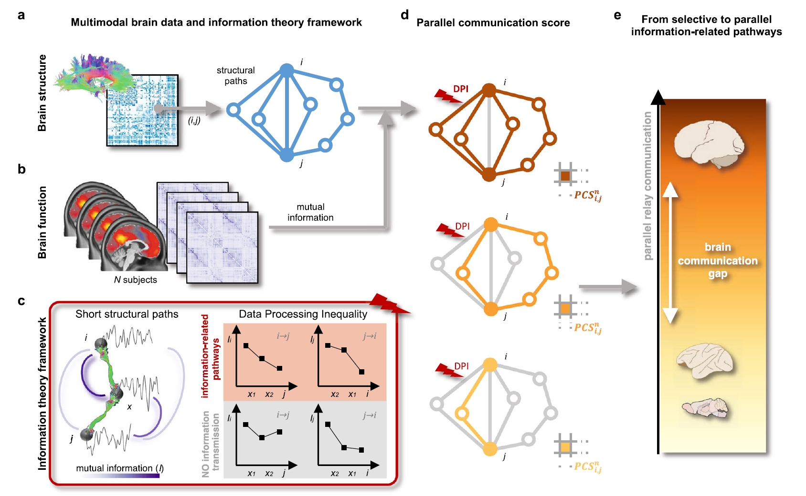

## 针对精神障碍的人脑连接组的并行信息传输损伤机制研究
### 背景
理解神经系统中的通信和信息处理是神经科学的核心目标。神经元素之间的信号传递和信息传输渗透到大脑功能的每一个方面和空间尺度：从神经元到神经元的突触传输，到神经元群体之间的交互，到整个大脑的区域共激活模式。理解控制神经信号灵活调节的机制是现代神经科学的持久挑战之一。为了解决这个问题，研究方向多种多样，包括但不限于神经编码，神经振荡的同步性和相干性，区域间通信子空间，以及神经动力学的计算模型。因此，通信这个主题既广泛又是神经科学探究的核心。在过去的二十年中，连通组学和网络神经科学的进步为研究复杂脑网络中的多突触通信开辟了新的途径。系统神经科学已经尝试将大脑通信映射为宏观尺度的结构和功能连接模式，强调了复杂惊人的结构-功能相互依赖性。结构性大脑网络（连接组图） 根据一系列复杂的拓扑属性进行组织，包括一个由密集连接的中心节点，模块化和分层结构，以及小世界架构。这些大脑组织的原则在各种物种和空间尺度上都普遍存在，被推测是由于神经通信效率的进化压力产生的。区域间信号传递被认为能使远离的区域协调他们的活动，以应对不断变化的认知和行为需求，而神经通信的损伤可能涉及到多种神经精神疾病的病因和症状表现。因此，阐明控制连接组图通信的机制对于基础、认知和临床大脑科学的进步至关重要。

尽管结构连接的区域对倾向于比未连接的对具有更强的功能连接，表明存在单突触相互作用。然而，直接的结构连接本身并不能解释在功能大脑中观察到的大多数动态功能范围。除了单突触相互作用之外，远隔大脑区域之间的功能连接可能源自更复杂的、更高阶的通信机制，这些机制涉及更大量的神经元素及其结构互连，可能通过神经信息的多步（多突触）路由实现。几个哺乳动物和更简单物种的大脑网络具有短的结构路径长度，这是以相对较高的布线成本为代价的，这表明多突触最短路径有助于大脑网络中的高效通信，并在进化过程中被选择，尽管它们的布线成本很高。然而，仅通过最短路径的有选择性通信模型只能解释功能连接的有限部分，并排除了大脑网络连接和近优替代路径的大部分，这指出了多条路径对大脑通信模型的相关性。事实上，在许多现实世界系统中，信息传递是通过许多替代路径根据并行通信方案进行的。在大脑中，平行通信可能增加传输保真度、鲁棒性和对大脑损伤的抵抗力，同时在通信效率和代谢消耗之间实现合理的权衡。此外，多个通信通道可能在不同的时刻一起使用或分别使用，以支持不断变化的内部和外部表征和包括更高级认知在内的复杂功能。

### 目的
本课题以基于磁共振多模态影像的人脑连接组为研究对象，提出了一种基于图信息理论的方法来模拟宏观尺度大脑网络中的多突触信息传递机制，并探索精神障碍引起的神经通信损伤模式。

### 准备工作
1. 理解MRI影像及脑连接组基础概念，[部分参考](https://github.com/chenfei-ye/students_proj)。
2. 精读人脑网络通信的重要文献[^37438433][^33195944]。
3. 基于[Fallon2020的HCP脑网络数据](https://github.com/chenfei-ye/students_proj?tab=readme-ov-file#hcp%E6%95%B0%E6%8D%AE)复现脑网络并行通信分数（PCS）的计算方法[^38081838]。

### 研究内容
1. 【对应毕业论文第三章的研究主题】：基于图信息理论，提出人脑连接组的并行信息传输能力(parallel information transmission)的定量描述方法[^38081838]，基于HCP健康人脑连接组数据探索并行通信分数（PCS）在Yeo功能子网络水平的分布（参考Fig3a，the average nodal PCS scores per brain system）。
2. 【对应毕业论文第四章的研究主题】：针对TCP跨诊断精神障碍影像数据，基于并行通信分数（PCS）解析精神障碍特有的神经通信损伤模式(groupwise comparison between patients and controls)，并探索该模式与疾病患者行为学表型（精神障碍量表与认知功能量表）的关联（Spearman correlation analysis）。
3. 【对应毕业论文第三、四章的补充分析】：敏感性分析（sensitivity analysis），分析PCS指标在健康人数据上的可重复性(test-retest reliability)，以及PCS指标在疾病应用上跨脑图谱的稳定性（Schaefer atlases with 100/200/400 nodes, or compared with other atlases, like HCP atlas）。

### 技术指标
1. 建立一个脑网络并行通信分数（PCS）的计算流程(python版本)，并在不少于两个数据集上进行指标对比（HCP健康人群数据和TCP中的健康人群数据）。
2. 发现与脑网络并行信息传输能力具有统计显著性相关且相关系数>0.3的精神障碍患者行为学表型不少于2种。

### 关键点
1. 要求脑网络通信计算方法部分全部用Python实现，推荐进度汇报用jupyter notebook导出PDF，以图码并茂的形式展现阶段性分析结果。
2. TCP精神障碍脑网络数据联系导师获取，数据来源描述[参考](https://github.com/HolmesLab/TransdiagnosticConnectomeProject)，数据形式描述[参考](https://xcp-d.readthedocs.io/en/latest/outputs.html)。TCP数据只针对人脑皮层区域的功能连接进行分析，皮层下脑区暂时不考虑。精神障碍量表重点包括`Clinician-Administered_Scales`部分，认知功能量表重点考虑`TestMyBrain`部分。
3. 可视化参考[nilearn](https://nilearn.github.io/dev/index.html)和[enigma](https://enigma-toolbox.readthedocs.io/en/latest/pages/12.visualization/index.html)。

[^38081838]: Griffa A, Mach M, Dedelley J, Gutierrez-Barragan D, Gozzi A, Allali G, Grandjean J, Van De Ville D, Amico E. Evidence for increased parallel information transmission in human brain networks compared to macaques and male mice. Nat Commun. 2023 Dec 11;14(1):8216. doi: 10.1038/s41467-023-43971-z. PMID: 38081838; PMCID: PMC10713651.
[^37438433]: Seguin C, Sporns O, Zalesky A. Brain network communication: concepts, models and applications. Nat Rev Neurosci. 2023 Sep;24(9):557-574. doi: 10.1038/s41583-023-00718-5. Epub 2023 Jul 12. PMID: 37438433.
[^33195944]: Graham D, Avena-Koenigsberger A, Mišić B. Editorial: Network Communication in the Brain. Netw Neurosci. 2020 Nov 1;4(4):976-979. doi: 10.1162/netn_e_00167. PMID: 33195944; PMCID: PMC7655038.

